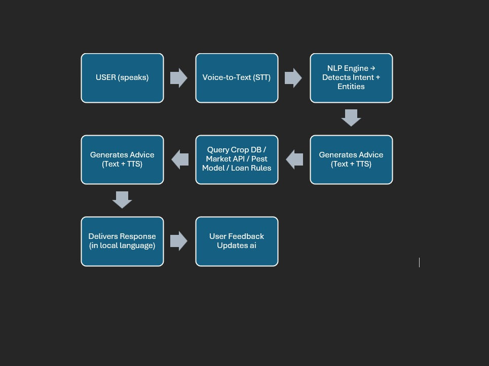

# Smart India Hackathon Workshop
# Date:
## Register Number:
## Name:
## Problem Title
SIH 25010: Smart Crop Advisory System for Small and Marginal Farmers
## Problem Description
A majority of small and marginal farmers in India rely on traditional knowledge, local shopkeepers, or guesswork for crop selection, pest control, and fertilizer use. They lack access to personalized, real-time advisory services that account for soil type, weather conditions, and crop history. This often leads to poor yield, excessive input costs, and environmental degradation due to overuse of chemicals. Language barriers, low digital literacy, and absence of localized tools further limit their access to modern agri-tech resources.

Impact / Why this problem needs to be solved

Helping small farmers make informed decisions can significantly increase productivity, reduce costs, and improve livelihoods. It also contributes to sustainable farming practices, food security, and environmental conservation. A smart advisory solution can empower farmers with scientific insights in their native language and reduce dependency on unreliable third-party advice.

Expected Outcomes

• A multilingual, AI-based mobile app or chatbot that provides real-time, location-specific crop advisory.
• Soil health recommendations and fertilizer guidance.
• Weather-based alerts and predictive insights.
• Pest/disease detection via image uploads.
• Market price tracking.
• Voice support for low-literate users.
• Feedback and usage data collection for continuous improvement.

Relevant Stakeholders / Beneficiaries

• Small and marginal farmers
• Agricultural extension officers
• Government agriculture departments
• NGOs and cooperatives
• Agri-tech startups

Supporting Data

• 86% of Indian farmers are small or marginal (NABARD Report, 2022).
• Studies show ICT-based advisories can increase crop yield by 20–30%.

## Problem Creater's Organization
Government of Punjab

## Theme
Agriculture, FoodTech & Rural Development

## Proposed Solution
Farmers, especially small and marginal ones, are often exploited by intermediaries who buy their produce at unfairly low prices. This forces farmers into a vicious cycle of low income, compelling them to purchase low-quality fertilizers, which degrade soil fertility and reduce land productivity. This downward spiral frequently leads to debt and financial instability.

Our AI-powered chatbot addresses this critical issue by providing real-time, accurate market price information tailored to the farmer’s location and crop. Using simple voice input in their native language, farmers can query the AI about current market demand and prices, enabling them to make informed decisions on whether to sell their produce directly or negotiate better terms with middlemen. The chatbot also warns farmers about taking loans unnecessarily or under unfavorable conditions.

## Technical Approach
<h3>Technologies to be used:</h3>
<ul><li>

Artificial Intelligence (AI) & Machine Learning (ML):
For real-time crop advisory, price prediction, loan risk alerts, and natural language understanding.

Natural Language Processing (NLP):
Enables voice and text-based conversations in regional Indian languages like Punjabi, Hindi, etc.

Mobile App / Chatbot Platform:
Built using React Native or Flutter for cross-platform mobile support (Android first, considering farmer usage).

Backend Technologies:
Python (for AI models), Node.js (for real-time communication), Firebase or AWS for cloud services.

Database:
PostgreSQL or Firebase Realtime Database for storing user data, crop history, and usage metrics.

Image Recognition (Computer Vision):
To detect pests or diseases from photos uploaded by farmers (can use TensorFlow Lite or OpenCV).

</li>
Methodology and Implementation Process:

## Feasibility and Viability
<h3>The proposed AI-based market price tracking chatbot is highly feasible, as it leverages existing technologies such as speech-to-text, NLP, and government-provided APIs like Agmarknet and eNAM. Farmers can interact in their native language through simple voice input, while the system provides transparent mandi price updates and selling recommendations in easy-to-understand audio or text formats. With mobile penetration and improving rural connectivity, the solution can be deployed through a lightweight mobile app, ensuring accessibility for small and marginal farmers.

In terms of viability, the solution directly addresses a pressing challenge: farmers being exploited by intermediaries due to lack of price awareness. By empowering them with real-time information, the chatbot helps secure fair prices, reduce losses, and improve overall profitability. Over time, this financial stability enables farmers to invest in quality fertilizers and adopt sustainable practices, thereby preserving soil fertility and productivity.

The approach is scalable across different crops, regions, and languages, and aligns well with government initiatives in smart agriculture and rural development. While challenges such as data accuracy, connectivity, and farmer adoption exist, these can be mitigated through reliable data partnerships, hybrid online/offline features, and awareness programs. Overall, the solution is both practical and impactful, with the potential to transform rural livelihoods.</h3>

## Impact and Benefits
With improved income from better sales decisions, farmers can invest in quality fertilizers and sustainable farming practices, which help maintain soil health and enhance long-term productivity. This not only boosts their profitability but also contributes to the sustainability of their farmland and overall livelihood of the farmers.

## Research and References
<h3>1. NABARD All India Rural Financial Inclusion Survey (NAFIS) 2021–22: This survey indicates that 86% of Indian farmers are small or marginal, highlighting their vulnerability to market exploitation. 

2.ICT-based Agricultural Advisory Impact: Studies have shown that ICT-based advisories can increase crop yields by 20–30% by enabling data-driven decisions on pricing, input use, and timing of sales.</h3>
